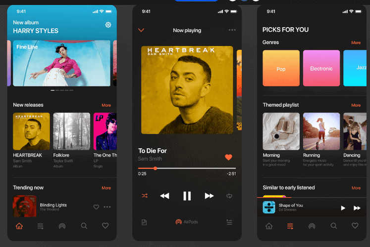
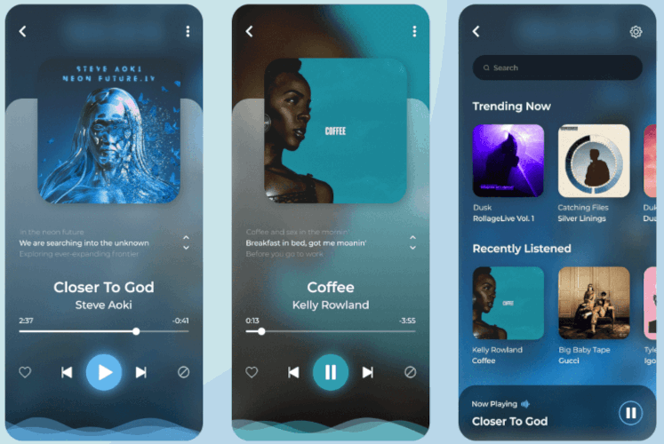
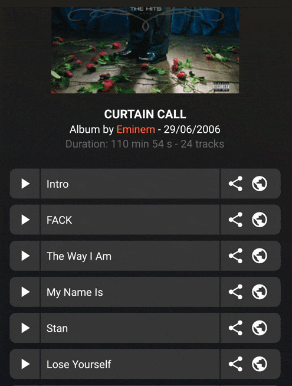

<h1 align="center">Deezer's OpenApi</h1>

<p align="center">
  <a href="https://android-arsenal.com/api?level=19"></a>
</p>

The main objective is crystal clear :

> By using the Deezer's Open API. Realize an interface with two screens :
> - The first screen, should provide a simple vertical scrollable grid to display a list of cover of albums. 
> - The second screen, appears after a click on an item from the previous grid and should display the details about the album.


## Implementation

I will split the details about my implementation in 3 parts: 
- [HomeActivity](https://github.com/1ud0v1c/deezer-open-api#homeactivity)
- [DetailActivity](https://github.com/1ud0v1c/deezer-open-api#detailactivity) 
- [AudiPlayer](https://github.com/1ud0v1c/deezer-open-api#audioplayer).

### HomeActivity

> 1 - Pour chaque album, vous devrez afficher l’image correspondante dans la grille. En attendant que les images soient chargées, ces images devront toutes avoir une image par défaut.

> 2 - Lorsqu’une image est reçue du serveur, elle doit s’afficher avec une animation de type “fade_in”.


Thanks to the Glide library, it is pretty easy to provide a placeholder like you can see on the above screen. As soon as, we have fetched the result of the API.
We display the number of items and a default cover while waiting for all images to load. The API load the data by a batch of 25 albums, I used an [EndlessRecyclerViewScrollListener](https://guides.codepath.com/android/endless-scrolling-with-adapterviews-and-recyclerview) to be able to detect the end of the first batch and thus trigger a new fetch when reached. It provides a smooth experience for the user.

I handled the case when you can have a weak connection and could have a timeout while fetching the albums.


### DetailActivity

> 3 - Le tap sur un album devra afficher un second écran affichant les détails de l’album.

> 4 - Laissez libre cours à votre imagination

As soon as you have clicked on an item, we transfer the result of the date fetched during the cover loading by passing them with an Intent. We display all the current data we have about the album, while 
loading the tracks of the album. When, it is done, we can display them. As for the album, we also have a default profile image of the artist.


Like for the HomeActivity, I handled the weak connection and thus the timeout which can occur.


With a click on one of the tracks, you can launch an audio player (more detail about it incoming) and listen to the preview of the song. I also provided a little animation to put the focus on the current selected song. Last, but not least I provided two intents to be able to share or look for the track on internet. 


### AudioPlayer

I saw that the API gives us the possibility to listen to a preview of each track of an album. So I wanted to add an audio player. My first solution was pretty basic.
I implemented a wrapper about the [MediaPlayer class](https://developer.android.com/reference/android/media/MediaPlayer) and on click on a track, you could listen 
to the music preview played in the background. It was working well, but was a bit frustrating to not be able to control very precisely the player. I wanted to have a 
fine control, like audio application like Deezer does.


After reading a lot of documentation, I discovered the [MediaSession API](https://developer.android.com/reference/android/media/session/MediaSession) and wanted to 
implement it. It took me some time to understand it, but I think I succeeded to make a simple implementation of it. Thanks to some [project example](https://github.com/android/uamp) and of conference like the [2016's Google I/O](https://www.youtube.com/watch?v=iIKxyDRjecU).

Here is the result of the player project :


## Design

I am clearly not a designer, but by looking about cool projects on website like [behance](https://www.behance.net/), [deviantart](https://www.deviantart.com/) 
or [dribble](https://dribbble.com/). I think I proposed a good look and feel for the project. I am thankful for the following inspirations :

[](https://www.behance.net/gallery/101826665/Music-App?tracking_source=search_projects_recommended%7Cmusic%20player)

[](https://www.behance.net/gallery/95865021/Music-Player-Mobile-App?tracking_source=search_projects_recommended%7Cmusic%20player)

I didn't have many occasion to play with [AnimatedVectorDrawable](https://developer.android.com/reference/android/graphics/drawable/AnimatedVectorDrawable), but I took time for this project to play with it. And thanks to this [wonderful project](https://shapeshifter.design) and this [wonderful tutorial](https://sourcediving.com/android-recipes-the-easy-path-to-animated-icons-878bffcb0920), I have been able to 
implement a simple animation, when you click on a track from the DetailTrackAdapter you have a color and morphing animation playing together. 



I found the icon launcher of the application on [deviantArt](https://www.deviantart.com/icondesire/art/Music-Player-348049166).


## Architecture 

I used an MVP architecture for my application. 


For example, if we check the home activity implementation, we can see 4 classes :
- HomeContract, an interface which defines which events the View and the Interactor will provide. 
- HomeActivity, it is the View himself, which implements HomeContract.View
- HomePresenter, the man-in-the middle classes which make the linking between the View and the Model (the interactor), and which implements HomeContract.Interactor
- HomeInteractor, last but not least the class which does all the business logic.

I found this architecture pretty well because thanks to it. I can easily test the business logic, I just have to test the Interactor class to do it. 


## What went wrong during the test

- Like I said before, I find that the documentation about the Media API was a bit disparate. I needed to go to a page, continue on another and so on. So it took me more time that I wanted to understand 
the documentation.
- Another problem that I didn't expect was the retro compatibility with Android 4.4 (KitKat). I had multiple issues :
	- With the OkHttp requests, they dropped the support of [Android 4.4](https://medium.com/square-corner-blog/okhttp-3-13-requires-android-5-818bb78d07ce) for the 
latest version to only support TLS 1.2. I made a workaround which only authorizes requests made to the deezer domain name. The best solution would be to use [the 
ProviderInstaller](https://medium.com/tech-quizlet/working-with-tls-1-2-on-android-4-4-and-lower-f4f5205629a) proposed by google.
	- To able to use AnimatedVectorDrawable for Android KitKat, you need to set the following command: ```AppCompatDelegate.setCompatVectorFromResourcesEnabled(true)``` in the onCreate of the Activity which needs it.
	- Last, but not least, the media notification, [can't use vector drawable](https://stackoverflow.com/questions/37333930/notification-throws-error-when-using-vector-drawables), you need to use png.


## External dependencies

- [Retrofit](https://github.com/square/retrofit): A type-safe HTTP client for Android. I used a moshi converter. I tend to use moshi over 
gson or jackson since I saw [that talk](https://www.youtube.com/watch?time_continue=2526&v=1PwdqkKDCSo&feature=emb_logo). Moshi seems to 
better handle accent and error than Gson and is much smaller than Jackson. 
- [Coroutines](https://kotlinlang.org/docs/reference/coroutines-overview.html): Light-weight thread implementation. I like the 
readability and the simplicity of coroutine.
- [Glide](https://github.com/bumptech/glide): Fast and efficient open source image loading framework for Android that wraps media 
decoding, memory and disk caching, and resource pooling. Easy to use and easily configurable, it was the perfect library to load gif.


## Unit tests

I used [robolectric](https://github.com/robolectric/robolectric) & [mockito](https://site.mockito.org/) (mainly to mock MediaSession object) for my unit tests 
and [espresso](https://developer.android.com/training/testing/espresso) for my instrumented tests.


## Devices tested 

Here are the list of all devices on which the application was tested.

- Samsung Galaxy S3 - Android 4.4: Lineage OS


- Redmi 4A - Android 6.0.1: MIUI Global 8.5


- OnePlus 5T - Android 10: Oxygen OS


- Google Pixel 3A - Android 11: Android stock


## What can be improved ?

- After analysis the json returned by the API, I saw that we can have a list of the top 50 tracks of an artist. I was thinking, it could be a great opportunity to add it in a separate page dedicated to the artist.
- For now, the application is only working, if you have access to the network. It could be very interesting to persist the data in an appropriate database. [Room](https://developer.android.com/topic/libraries/architecture/room) seems a great way to do it.
- I used the MediaPlayer because I already knew the class and how to use it. But, we could use the [ExoPlayer](https://developer.android.com/guide/topics/media/exoplayer) which provide more advance features like: Dynamic adaptive streaming over HTTP (DASH), SmoothStreaming and Common Encryption.
- I succeed to use the MediaSession API propose by Android to have a fully working audio player, but I would have been more than happy to be able to cast the player on my personal [Google Chromecast](https://store.google.com/product/chromecast_setup). Maybe later...
- During my reading about Media API, I took time to watch the last news about it and for Android 11, they introduce a "[Seamless transfer](https://youtu.be/fhii2K9o6ts?t=320)" functionality. They gave us the possibility to change the audio output, easily from the notification. A must have.
